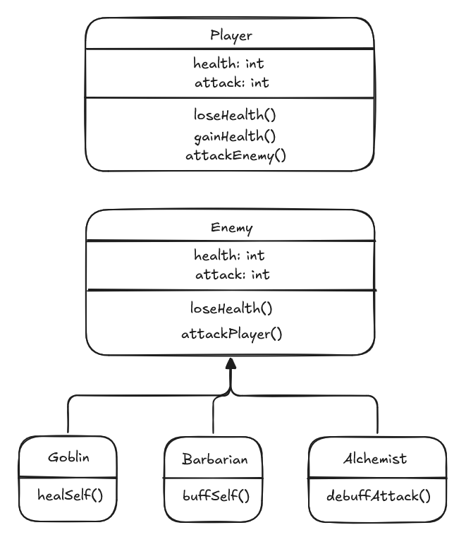

# **11SE TASK 2 2025 - TURN-BASED COMBAT GAME**

# Requirements Definition

## Functional Requirements

The program is a text-based turn-based combat game. Its capabilities must include:
- Having enemies which attack the player
- Allowing the player to use moves to combat said enemies

## Non-Functional Requirements

The program should:
- Run quickly and smoothly
- Be easy to use
- Lack errors

# Determining Specifications

## Functional Specifications

### User Requirements

The user needs to be able to perform various actions, including:
- Attacking enemies with their weapons
- Buffing themselves with various effects

### Input & Output

The user's inputs will consist of a number typed in. Certain numbers will correspond to a command, which changes depending on context.
Output from the program should consist of information regarding the state of the game, such as the status of the player or enemy or actions being performed.

### Core Features

At its core, the program must be able to:
- Display the state of the game, including enemy and player health
- Allow the player to perform various actions, including attacking and using self-buffs
- Feature enemies which also perform various actions, including but not limited to self-buffs and attacks

### User Interaction

Users will interact with the program through a command line and text input. 

## Non-Functional Specifications

### Performance

Each task performed by the system should take under a second.

### Reliability

Errors in calculations of damage and health values are a potential issue.

# Sprint 1

## Build

```
import time

def main():

    while True:

        print('\nChoose an action!')
        print('\n1 - Attack')
        print('2 - Skill')
        print('3 - Other Skill')
        print('4 - Use Item')
        command = input('\nType in the corresponding number! ')

        if command == '1':
            print("You tried to attack... and MISSED! you tried")
        elif command == '2':
            print("wait hold on i haven't even coded this in yet")
        elif command == '3':
            print("You didn't use Other Skill!")
        elif command == '4':
            print("ITEMS: Fish, fish-shaped medkit, fish-shaped sediment, fish-shaped toilet, fish-shaped fish. You don't like fish so all of these are unusuable, sorry.")
        else:
            print("sorry but im completely illiterate outside of the very narrow selection of commands on your menu")

        time.sleep(2)

if __name__ == "__main__":
    main()
```

## Review
This build acted as a framework for the program - and it did its job accordingly. It's readable, well organised, and shouldn't need any more refinements to its code structure - other than adding the core gameplay loop.

# Sprint 2

## Build

```
import time
import random
import objects

player = objects.Player('The Knight', 7, 30)
goblin = objects.Goblin(random.choice(('Krubs', 'Alb', 'Klaank')), 3, 8)
barbarian = objects.Barbarian(random.choice(('Ragnar', 'Korgoth', 'Holfar')), 7, 18)
alchemist = objects.Alchemist(random.choice(('Eloran', 'Orin', 'Mira', 'John Alchemy')), 5, 12)

print(f"You face {goblin.name}, {barbarian.name}, and {alchemist.name}!")

def kickingBodies(victim):
    print(f"{player.name} kicks {victim} while they're down. Jerk.")

def gameStatus():
    print('\n[GAME STATUS]')
    print(f"\n{player.name} (that's you) has {player.health} HP and {player.attack} ATK.")
    print(f"{goblin.name} the {type(goblin).__name__} has {goblin.health} HP and {goblin.attack} ATK.")
    print(f"{barbarian.name} the {type(barbarian).__name__} has {barbarian.health} HP and {barbarian.attack} ATK.")
    print(f"{alchemist.name} the {type(alchemist).__name__} has {alchemist.health} HP and {alchemist.attack} ATK.")

    if goblin.health <= 0 and barbarian.health <= 0 and alchemist.health <= 0:
        print(f"\n{player.name} wins the battle!")
        quit()

def attack():
    print("\nWho would you like to attack?")
    print(f"1 - {goblin.name} the {type(goblin).__name__}")
    print(f"2 - {barbarian.name} the {type(barbarian).__name__}")
    print(f"3 - {alchemist.name} the {type(alchemist).__name__}")
    command = input('\nType in a corresponding number... ')

    if command == '1':
        if goblin.health > 0:
            player.dealDamage(goblin)
        else:
            kickingBodies(goblin.name)

    if command == '2':
        if barbarian.health > 0:
            player.dealDamage(barbarian)
        else:
            kickingBodies(barbarian.name)

    if command == '3':
        if alchemist.health > 0:
            player.dealDamage(alchemist)
        else:
            kickingBodies(alchemist.name)


def main():

    while True:
        
        gameStatus()

        print('\nChoose an action!')
        print('\n1 - Attack')
        print('2 - Heal')
        print('3 - Charge Weapon')
        command = input('\nType in the corresponding number! ')

        if command == '1':
            attack()
        elif command == '2':
            player.gainHealth(20)
        elif command == '3':
            player.gainAttack(2)
        else:
            print("Congratulations! You do nothing.")

        time.sleep(1.5)

        print('')

        for _ in range(2):
            if goblin.health > 0:
                if random.randint(1, 2) == 1:
                    goblin.eatMeat(2)
                else:
                    goblin.dealDamage(player)
            else:
                goblin.groan()

        time.sleep(1.5)

        if barbarian.health > 0:
            if random.randint(1, 3) == 1:
                barbarian.warCry(2)
            else:
                barbarian.dealDamage(player)
        else:
            barbarian.groan()

        time.sleep(1.5)

        if alchemist.health > 0:
            if random.randint(1, 3) == 1:
                alchemist.debuffPlayer(player, 2)
            else:
                alchemist.dealDamage(player)
        else:
            alchemist.groan()

        time.sleep(1.5)

if __name__ == "__main__":
    main()
```

## Review

This build meets most of the requirements initially made - although health gained from healing can exceed a character's initial, or maximum, health, which violates the reliability specification.

# Sprint 3

## Design



## Build

Since classes were already implemented in Sprint 2, a new build is not necessary.

## Review

The program's naming conventions and overall structure are mostly fine, but the main loop is a bit cluttered near the bottom. In the next build, the code quality could use some cleaning.

# Sprint 4

## Design


## Build

import time
import random
import objects

player = objects.Player('The Knight', 7, 30, 30)
goblin = objects.Goblin(random.choice(('Krubs', 'Alb', 'Klaank')), 3, 8, 8)
barbarian = objects.Barbarian(random.choice(('Ragnar', 'Korgoth', 'Holfar')), 7, 18, 18)
alchemist = objects.Alchemist(random.choice(('Eloran', 'Orin', 'Mira', 'John Alchemy')), 5, 12, 12)

print(f"You face {goblin.name}, {barbarian.name}, and {alchemist.name}!")

def kickingBodies(victim):
    print(f"{player.name} kicks {victim} while they're down. Jerk.")

def gameStatus():
    print('\n[GAME STATUS]')
    print(f"\n{player.name} (that's you) has {player.health}/{player.maxhp} HP and {player.attack} ATK.")
    print(f"{goblin.name} the {type(goblin).__name__} has {goblin.health}/{goblin.maxhp} HP and {goblin.attack} ATK.")
    print(f"{barbarian.name} the {type(barbarian).__name__} has {barbarian.health}/{barbarian.maxhp} HP and {barbarian.attack} ATK.")
    print(f"{alchemist.name} the {type(alchemist).__name__} has {alchemist.health}/{alchemist.maxhp} HP and {alchemist.attack} ATK.")

    if goblin.health <= 0 and barbarian.health <= 0 and alchemist.health <= 0:
        print(f"\n{player.name} wins the battle!")
        quit()

def playerAttack():

    print("\nWho would you like to attack?")
    print(f"1 - {goblin.name} the {type(goblin).__name__}")
    print(f"2 - {barbarian.name} the {type(barbarian).__name__}")
    print(f"3 - {alchemist.name} the {type(alchemist).__name__}")
    command = input('\nType in a corresponding number... ')

    if command == '1':
        if goblin.health > 0:
            player.dealDamage(goblin)
        else:
            kickingBodies(goblin.name)

    if command == '2':
        if barbarian.health > 0:
            player.dealDamage(barbarian)
        else:
            kickingBodies(barbarian.name)

    if command == '3':
        if alchemist.health > 0:
            player.dealDamage(alchemist)
        else:
            kickingBodies(alchemist.name)

def goblinAction():

    if goblin.health > 0:
        for _ in range(2):
            if goblin.health != goblin.maxhp:
                if random.randint(1, 2) == 1:
                    goblin.eatMeat(2)
                else:
                    goblin.dealDamage(player)
            else:
                goblin.dealDamage(player)
    else:
        goblin.groan()
    time.sleep(1.5)

def barbarianAction():

    if barbarian.health > 0:
        if random.randint(1, 3) == 1:
            barbarian.warCry(2)
        else:
            barbarian.dealDamage(player)
    else:
        barbarian.groan()
    time.sleep(1.5)

def alchemistAction():

    if alchemist.health > 0:
        if random.randint(1, 3) == 1:
            alchemist.debuffPlayer(player, 2)
        else:
            alchemist.dealDamage(player)
    else:
        alchemist.groan()
    time.sleep(1.5)

def main():

    while True:
        
        gameStatus()

        print('\nChoose an action!')
        print('\n1 - Attack')
        print('2 - Heal')
        print('3 - Charge Weapon')
        command = input('\nType in the corresponding number! ')

        if command == '1':
            playerAttack()
        elif command == '2':
            player.gainHealth(20)
        elif command == '3':
            player.gainAttack(4)
        else:
            print("Congratulations! You do nothing.")

        time.sleep(1.5)

        print('')

        goblinAction()
        barbarianAction()
        alchemistAction()

if __name__ == "__main__":
    main()

## Review

The project meets the specified requirements currently defined in planning. In this build, the main loops has been cleaned up significantly, and maximum health values now exist, which both serve as a quality-of-life enhancement for the player and ensure that characters cannot 'overheal' with healing moves.

# Evaluation of System

In future updates, the system could be reworked to be more flexible towards new additions, so updating the game with more enemies, actions, etc, will be far more convenient. Additionally, there could be a sort of text-based adventure system outside of combat.

Project management was less than stellar. Having fallen to the old pitfalls of procrastination, most of the work was done in the last few days. While some features proposed at the project birth were scrapped, some were also concieved and added in between sprints.

The OOP features helped greatly during the development of this project - as a turn based combat game, the program, of course, had characters, which would undoubtedly have been difficult to implement in a more procedural programming style. With OOP, however, each character was far easier and more convenient to create, manage, and modify. 